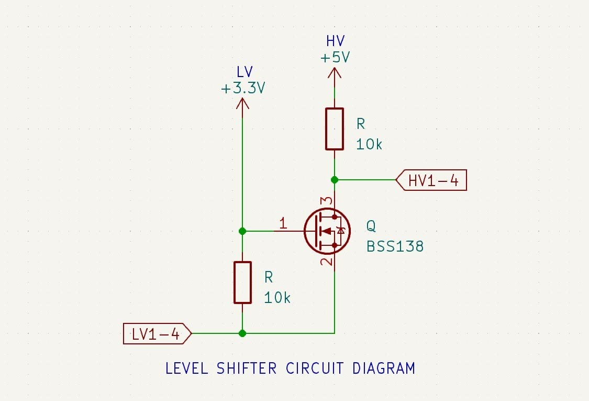

# Level Shifter

The K30 is a 3.3V sensor, while the Arduino operates at 5V. To ensure proper communication and prevent damage to the components, a level shifter is used to interface the two voltage levels. The level shifter allows the 5V signals from the Arduino to be safely converted to 3.3V for the K30 sensor, and vice versa for the data signals coming from the sensor back to the Arduino. 

- HV (5Vdc) from the test point on the interface board is connected to the VH pin of the level shifter.
- LV (3.3Vdc) is connected to the K30's regulated DVCC voltage
- GND is not connected on the level shifter, but ground is common between the Arduino, K30 sensor, and the level shifter.
- LV1 - SDA from K30
- HV1 - SDA from Arduino
- LV2 - SCL from K30
- HV2 - SCL from Arduino

## Circuit Diagram

## Wiring Connections

