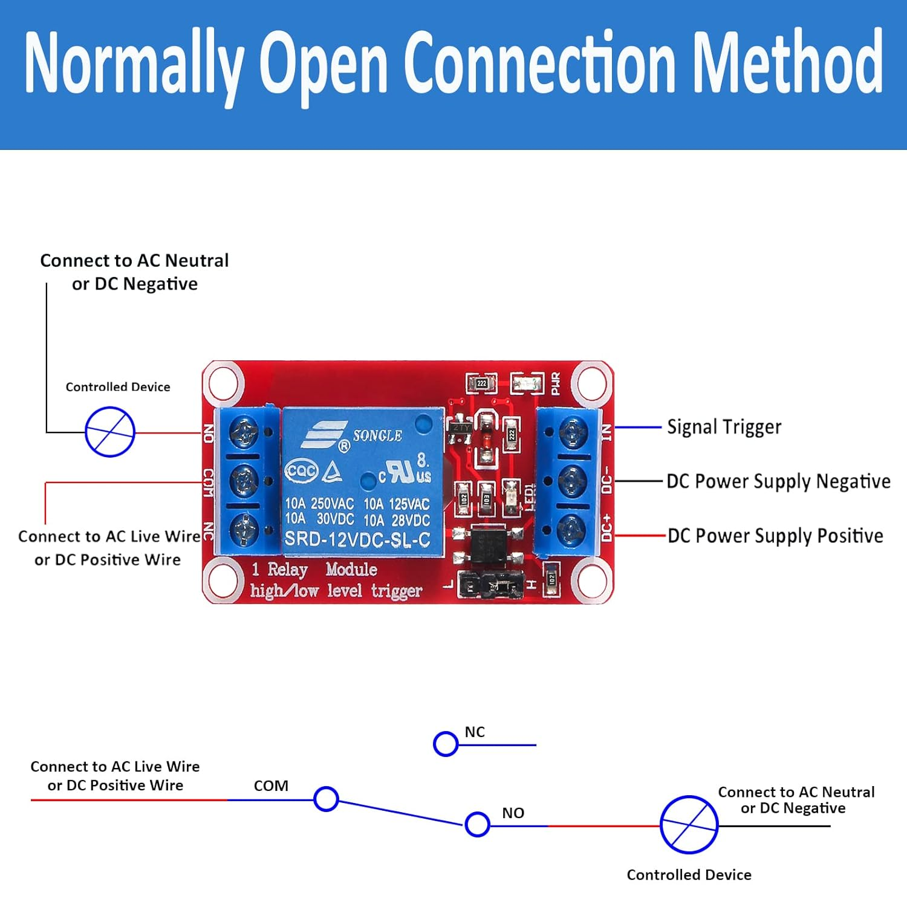

# Power Relay

A power-interrupting relay was added to the design to control power to the K30 CO₂ sensor. This allows the sensor to be powered up after the Arduino has completed its bootup sequence, which helps to prevent spurious short-circuit issues (e.g., "E04" errors) that can occur upon power up of the system.

K30 is turned on by the Arduino only after the Arduino has completed its bootup sequence.  The relay is triggered by an opto-isolated signal from the Arduino.

- DC+ - connect to the 5Vdc regulated power
- DC- - Ground
- Signal Trigger - TODO - connected to Arduino digital output pin XXX. Pull-down resistor (4.7Kohm - 10Kohm) must be connected from this pin to ground to ensure the relay is OFF during power on and reset.
- COM - 12Vdc regulated power
- NO (Normally Open) - connected to G+ on the K30 sensor
- NC - unused

## Circuit Diagram

TODO

Pull-down resistors (4.7Kohm - 10Kohm) must be connected from Arduino digital output to ground to ensure the relay is OFF during power on and reset.

## Wiring Connections
